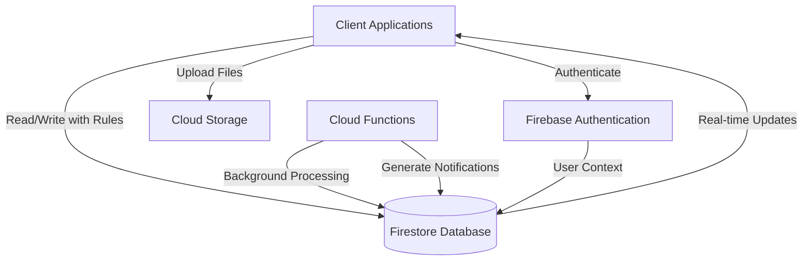
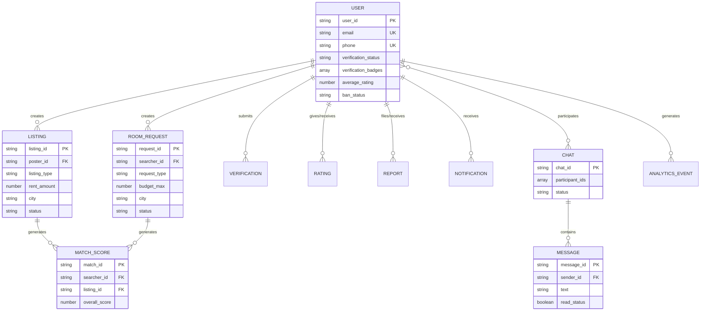

# Design Document: Firebase Database Integration

## Overview

This design document specifies the technical implementation for a Firebase Firestore database integration supporting a trust-first, verified, smart-matching room and rental platform. The system connects accommodation seekers (students, exam candidates, interns, professionals) with accommodation providers (students, PG owners) through intelligent matching, real-time communication, and comprehensive safety controls.

### Core Design Principles

1. **Security-First Architecture**: All data access controlled through Firebase Security Rules with role-based permissions
2. **Real-Time Synchronization**: Leverage Firestore's real-time listeners for live updates in chat, notifications, and status changes
3. **Scalable Data Model**: Denormalized structure optimized for read-heavy operations with strategic use of subcollections
4. **Trust and Verification**: Multi-layered verification system with document storage and status tracking
5. **Performance Optimization**: Composite indexes for common query patterns with pagination support
6. **Data Integrity**: Server-side validation through Security Rules ensuring consistent data formats

### Technology Stack

- **Database**: Firebase Firestore (NoSQL document database)
- **Authentication**: Firebase Authentication (integrated with Security Rules)
- **Storage**: Firebase Cloud Storage (for verification documents and listing images)
- **Functions**: Firebase Cloud Functions (for background tasks like match score calculation and notification generation)
- **Security**: Firebase Security Rules (declarative access control)

## Architecture

### High-Level Architecture



### Data Flow Patterns

1. **User Profile Creation Flow**
   - Client authenticates via Firebase Auth
   - Client creates user document in Firestore
   - Security Rules validate required fields and permissions
   - Document stored with auto-generated timestamps

2. **Verification Flow**
   - User uploads documents to Cloud Storage
   - Client creates verification document with storage URLs
   - Admin reviews and updates verification status
   - Cloud Function updates user verification badges
   - Real-time listener notifies user of status change

3. **Smart Matching Flow**
   - Cloud Function triggers on new listing/request creation
   - Function calculates match scores based on multiple criteria
   - Match score documents written to match_scores collection
   - Client queries personalized feed ordered by match score

4. **Real-Time Chat Flow**
   - Client creates chat session with participant IDs
   - Messages written to subcollection under chat session
   - Real-time listeners on both clients receive instant updates
   - Last message timestamp updated on chat session document

5. **Safety Reporting Flow**
   - User creates report document (write-once)
   - Admin queries reports by status
   - Admin updates report with action taken
   - Cloud Function may update user ban status based on action

## Components and Interfaces

### Core Collections

#### 1. Users Collection (`users`)

**Purpose**: Store user profile information, verification status, and aggregate statistics

**Document Structure**:
```typescript
interface UserDocument {
  user_id: string;              // Primary identifier
  name: string;
  age: number;                  // 18-100
  gender: 'male' | 'female' | 'other';
  phone: string;                // 10 digits
  email: string;                // Valid email format
  city: string;
  home_district: string;
  user_type: 'searcher' | 'poster' | 'both';
  
  // Student verification fields (optional)
  college?: string;
  course?: string;
  year?: number;
  student_id_url?: string;
  
  // Professional verification fields (optional)
  company?: string;
  role?: string;
  professional_id_url?: string;
  
  // Identity verification fields
  aadhaar_verified: boolean;
  pan_verified: boolean;
  selfie_url?: string;
  verification_status: 'unverified' | 'pending' | 'verified' | 'rejected';
  verification_badges: string[]; // ['student', 'professional', 'identity']
  
  // Aggregate statistics
  average_rating: number;
  total_ratings: number;
  rating_distribution: { [key: number]: number }; // {5: 10, 4: 5, ...}
  
  // Moderation fields
  ban_status: 'none' | 'active';
  ban_reason?: string;
  ban_expires_at?: Timestamp;
  
  // Timestamps
  created_at: Timestamp;
  updated_at: Timestamp;
}
```

**Indexes**:
- Single field: `user_id`, `email`, `phone`
- Used for: User lookup, authentication, profile retrieval

**Subcollections**:
- `matching_criteria`: User-specific matching weights
- `verification_history`: All verification attempts
- `moderation_history`: All reports and actions

#### 2. Verifications Collection (`verifications`)

**Purpose**: Track verification document submissions and review status

**Document Structure**:
```typescript
interface VerificationDocument {
  verification_id: string;
  user_id: string;
  verification_type: 'student' | 'professional' | 'aadhaar' | 'pan' | 'selfie';
  document_url: string;         // Cloud Storage URL
  status: 'pending' | 'approved' | 'rejected';
  
  // Biometric verification fields (for selfie type)
  liveness_check_result?: boolean;
  
  // Review information
  submitted_at: Timestamp;
  reviewed_at?: Timestamp;
  reviewer_id?: string;         // Admin user_id
  rejection_reason?: string;
  
  created_at: Timestamp;
}
```

**Indexes**:
- Composite: `user_id` + `status`
- Composite: `status` + `submitted_at`
- Used for: Admin review queue, user verification history

#### 3. Listings Collection (`listings`)

**Purpose**: Store accommodation offerings from posters

**Document Structure**:
```typescript
interface ListingDocument {
  listing_id: string;
  poster_id: string;
  title: string;
  description: string;
  listing_type: 'long_term' | 'pg' | 'flatmate' | 'short_stay' | 'emergency';
  
  // Pricing
  rent_amount: number;          // Positive number
  deposit_amount: number;
  
  // Availability
  available_from: Timestamp;
  
  // Location
  location: string;             // Address
  city: string;
  latitude: number;             // -90 to 90
  longitude: number;            // -180 to 180
  
  // Details
  amenities: string[];          // ['wifi', 'parking', 'kitchen', ...]
  preferences: {
    gender_preference?: 'male' | 'female' | 'any';
    profession_preference?: string[];
    other_requirements?: string;
  };
  
  // Media
  images: string[];             // Max 10 Cloud Storage URLs
  
  // Status
  status: 'active' | 'inactive' | 'rented' | 'deleted';
  
  // Timestamps
  created_at: Timestamp;
  updated_at: Timestamp;
}
```

**Indexes**:
- Composite: `city` + `listing_type` + `status` + `created_at`
- Composite: `poster_id` + `status`
- Composite: `city` + `status` + `available_from`
- Used for: Search queries, poster's listings, availability filtering

#### 4. Room Requests Collection (`room_requests`)

**Purpose**: Store accommodation needs from searchers

**Document Structure**:
```typescript
interface RoomRequestDocument {
  request_id: string;
  searcher_id: string;
  title: string;
  description: string;
  
  // Timeline
  needed_from: Timestamp;
  needed_until: Timestamp;
  request_type: 'normal' | 'emergency';
  expires_at?: Timestamp;       // Set for emergency requests (3 days)
  
  // Budget
  budget_min: number;           // Positive number
  budget_max: number;
  
  // Location
  city: string;
  
  // Preferences
  preferences: {
    location_preference?: string;
    amenities_required?: string[];
    other_requirements?: string;
  };
  
  // Status
  status: 'active' | 'fulfilled' | 'expired' | 'deleted';
  
  // Timestamps
  created_at: Timestamp;
  updated_at: Timestamp;
}
```

**Indexes**:
- Composite: `city` + `request_type` + `status` + `created_at`
- Composite: `searcher_id` + `status`
- Composite: `status` + `expires_at`
- Used for: Search queries, searcher's requests, expiration processing

#### 5. Match Scores Collection (`match_scores`)

**Purpose**: Store calculated compatibility scores between searchers and listings

**Document Structure**:
```typescript
interface MatchScoreDocument {
  match_id: string;
  searcher_id: string;
  listing_id: string;
  
  // Score components (0-100)
  overall_score: number;
  education_score: number;
  college_score: number;
  profession_score: number;
  hometown_score: number;
  gender_match: boolean;
  proximity_score: number;
  
  // Metadata
  calculated_at: Timestamp;
}
```

**Indexes**:
- Composite: `searcher_id` + `overall_score` (descending)
- Composite: `listing_id` + `overall_score` (descending)
- Used for: Personalized feed generation, listing popularity

#### 6. Chats Collection (`chats`)

**Purpose**: Store chat sessions between users

**Document Structure**:
```typescript
interface ChatSessionDocument {
  chat_id: string;
  participant_ids: [string, string]; // Exactly 2 user_ids
  status: 'active' | 'blocked_by_user1' | 'blocked_by_user2' | 'blocked_by_both';
  
  // Timestamps
  created_at: Timestamp;
  last_message_at: Timestamp;
}
```

**Subcollection**: `messages`
```typescript
interface MessageDocument {
  message_id: string;
  sender_id: string;
  text: string;
  message_type: 'text' | 'system';
  read_status: boolean;
  timestamp: Timestamp;
}
```

**Indexes**:
- Composite: `participant_ids` (array-contains) + `last_message_at` (descending)
- Used for: User's chat list ordered by recent activity

#### 7. Ratings Collection (`ratings`)

**Purpose**: Store user reviews and ratings

**Document Structure**:
```typescript
interface RatingDocument {
  rating_id: string;
  reviewer_id: string;
  reviewee_id: string;
  listing_id?: string;          // Optional reference to listing
  
  // Rating content
  stars: number;                // 1-5
  review_text?: string;
  
  // Moderation
  status: 'active' | 'flagged' | 'removed';
  admin_notes?: string;
  
  // Timestamps
  created_at: Timestamp;
}
```

**Indexes**:
- Composite: `reviewee_id` + `status` + `created_at`
- Composite: `reviewer_id` + `reviewee_id` + `listing_id` (uniqueness constraint)
- Used for: Profile ratings display, duplicate prevention

#### 8. Reports Collection (`reports`)

**Purpose**: Store safety concern reports for admin review

**Document Structure**:
```typescript
interface ReportDocument {
  report_id: string;
  reporter_id: string;
  reported_user_id: string;
  report_type: 'fake_identity' | 'broker' | 'scam' | 'harassment';
  description: string;
  evidence_urls: string[];      // Cloud Storage URLs
  
  // Review status
  status: 'pending' | 'under_review' | 'resolved' | 'dismissed';
  reviewed_at?: Timestamp;
  reviewer_id?: string;         // Admin user_id
  action_taken?: string;
  
  // Timestamps
  created_at: Timestamp;
}
```

**Indexes**:
- Composite: `status` + `created_at`
- Composite: `reported_user_id` + `status`
- Used for: Admin review queue, user report history

#### 9. Notifications Collection (`notifications`)

**Purpose**: Store user notifications for platform activities

**Document Structure**:
```typescript
interface NotificationDocument {
  notification_id: string;
  user_id: string;
  type: 'new_match' | 'chat_message' | 'verification_approved' | 'listing_expired' | 'request_response';
  title: string;
  message: string;
  related_id?: string;          // ID of related entity
  read_status: boolean;
  
  // Timestamps
  created_at: Timestamp;
  expires_at?: Timestamp;       // Auto-delete after expiry
}
```

**Indexes**:
- Composite: `user_id` + `read_status` + `created_at` (descending)
- Composite: `expires_at` (for cleanup)
- Used for: User notification feed, expired notification cleanup

#### 10. Analytics Collection (`analytics`)

**Purpose**: Track user behavior and platform events

**Document Structure**:
```typescript
interface AnalyticsEventDocument {
  event_id: string;
  event_type: 'listing_view' | 'search_performed' | 'chat_initiated' | 'rating_submitted' | 'report_filed';
  user_id: string;
  session_id: string;
  metadata: { [key: string]: any }; // Event-specific data
  timestamp: Timestamp;
}
```

**Indexes**:
- Composite: `user_id` + `timestamp`
- Composite: `event_type` + `timestamp`
- Used for: User behavior analysis, platform metrics

#### 11. Daily Stats Collection (`daily_stats`)

**Purpose**: Store aggregated daily platform statistics

**Document Structure**:
```typescript
interface DailyStatsDocument {
  date: string;                 // YYYY-MM-DD format
  total_users: number;
  active_users: number;
  new_listings: number;
  new_requests: number;
  total_chats: number;
  total_reports: number;
  
  // Performance metrics
  avg_query_latency_ms: number;
  total_read_operations: number;
  total_write_operations: number;
}
```

**Indexes**:
- Single field: `date`
- Used for: Trend analysis, performance monitoring

### Cloud Functions

#### 1. calculateMatchScores

**Trigger**: onCreate for `listings` and `room_requests` collections

**Purpose**: Calculate compatibility scores between searchers and listings

**Algorithm**:
```typescript
function calculateMatchScore(searcher: UserDocument, listing: ListingDocument): MatchScoreDocument {
  let score = 0;
  
  // Education match (20 points)
  if (searcher.college && listing.poster.college === searcher.college) {
    score += 20;
  }
  
  // Profession match (15 points)
  if (searcher.company && listing.preferences.profession_preference?.includes(searcher.role)) {
    score += 15;
  }
  
  // Hometown match (15 points)
  if (searcher.home_district === listing.poster.home_district) {
    score += 15;
  }
  
  // Gender preference match (10 points)
  if (listing.preferences.gender_preference === 'any' || 
      listing.preferences.gender_preference === searcher.gender) {
    score += 10;
  }
  
  // Proximity score (20 points based on distance)
  const distance = calculateDistance(searcher.preferred_location, listing.location);
  score += Math.max(0, 20 - (distance / 1000)); // Decrease by 1 point per km
  
  // Verification badge bonus (20 points)
  const commonBadges = intersection(searcher.verification_badges, listing.poster.verification_badges);
  score += commonBadges.length * 5;
  
  return {
    overall_score: Math.min(100, score),
    education_score: /* calculated */,
    college_score: /* calculated */,
    // ... other component scores
  };
}
```

#### 2. updateAggregateRatings

**Trigger**: onCreate and onUpdate for `ratings` collection

**Purpose**: Recalculate user aggregate rating statistics

**Logic**:
- Query all active ratings for reviewee
- Calculate average, total, and distribution
- Update user document with new aggregates

#### 3. expireEmergencyRequests

**Trigger**: Scheduled (runs every hour)

**Purpose**: Update expired emergency requests to "expired" status

**Logic**:
- Query room_requests where status='active' and expires_at < now
- Batch update status to 'expired'
- Generate notifications for affected users

#### 4. generateNotifications

**Trigger**: Various onCreate/onUpdate events

**Purpose**: Create notification documents for relevant events

**Events**:
- New match score above threshold → "new_match" notification
- New message in chat → "chat_message" notification
- Verification status change → "verification_approved" notification
- Listing/request expiration → "listing_expired" notification

#### 5. cleanupExpiredNotifications

**Trigger**: Scheduled (runs daily)

**Purpose**: Delete notifications past their expiration date

**Logic**:
- Query notifications where expires_at < now
- Batch delete expired notifications

### Security Rules Structure

The Firebase Security Rules will be organized into functions for reusability:

```javascript
rules_version = '2';
service cloud.firestore {
  match /databases/{database}/documents {
    
    // Helper functions
    function isAuthenticated() {
      return request.auth != null;
    }
    
    function isOwner(userId) {
      return isAuthenticated() && request.auth.uid == userId;
    }
    
    function isAdmin() {
      return isAuthenticated() && 
             get(/databases/$(database)/documents/users/$(request.auth.uid)).data.role == 'admin';
    }
    
    function isNotBanned() {
      let user = get(/databases/$(database)/documents/users/$(request.auth.uid)).data;
      return user.ban_status != 'active' || 
             user.ban_expires_at < request.time;
    }
    
    function isValidEmail(email) {
      return email.matches('^[a-zA-Z0-9._%+-]+@[a-zA-Z0-9.-]+\\.[a-zA-Z]{2,}$');
    }
    
    function isValidPhone(phone) {
      return phone.matches('^[0-9]{10}$');
    }
    
    // Collection rules defined in next section
  }
}
```

## Data Models

### Entity Relationship Overview



### Data Denormalization Strategy

To optimize read performance in Firestore's NoSQL structure, we employ strategic denormalization:

1. **User Aggregate Statistics**: Store average_rating, total_ratings, and rating_distribution directly in user documents rather than calculating on-read
2. **Chat Last Message**: Store last_message_at timestamp in chat session document for efficient sorting
3. **Verification Badges**: Store array of completed verifications in user document for quick access control checks
4. **Match Score Components**: Store individual score components (education, proximity, etc.) for filtering and explanation

### Data Consistency Patterns

1. **Eventual Consistency**: Match scores and aggregate ratings updated via Cloud Functions (acceptable delay)
2. **Strong Consistency**: User verification status and ban status enforced in Security Rules (immediate effect)
3. **Optimistic Updates**: Client updates UI immediately, reverts on Security Rules rejection

### Data Lifecycle Management

1. **Soft Deletes**: Listings and room requests marked as "deleted" status rather than removed
2. **Expiration**: Emergency requests auto-expire after 3 days, notifications auto-delete after expiry
3. **Archival**: Analytics events older than 90 days moved to cold storage (BigQuery export)
4. **Retention**: User data retained for 2 years after account deletion per compliance requirements


## Correctness Properties

*A property is a characteristic or behavior that should hold true across all valid executions of a system—essentially, a formal statement about what the system should do. Properties serve as the bridge between human-readable specifications and machine-verifiable correctness guarantees.*

### Property Reflection

After analyzing all acceptance criteria, I identified several areas of redundancy:

1. **Data Structure Properties**: Multiple requirements specify field storage for different collections (users, listings, requests, etc.). These can be consolidated into a single property about document structure completeness.

2. **Enum Validation Properties**: Many requirements specify allowed enum values (listing_type, status, report_type, etc.). These share the same validation pattern and can be combined.

3. **Timestamp Update Properties**: Requirements 1.6 and 3.6 both specify updated_at timestamp behavior. These are identical and can be merged.

4. **Access Control Properties**: Requirements 9.5 and 9.7 both specify ownership-based CRUD access for listings and requests. These follow the same pattern.

5. **Real-Time Update Properties**: Multiple requirements (10.1, 10.2, 10.4, 10.6) specify real-time listener behavior for different document types. These can be consolidated into a general real-time synchronization property.

6. **Range Validation Properties**: Requirements 11.3, 11.4, 11.6, 11.9 all specify numeric range validation. These follow the same validation pattern.

After reflection, I've consolidated 107 testable criteria into 45 unique properties that provide comprehensive coverage without redundancy.

### Property 1: Document Structure Completeness

*For any* document type (User, Listing, RoomRequest, ChatSession, Rating, Report, Notification, AnalyticsEvent, DailyStats, MatchScore, Verification), when a document is created with all required fields for that type, the document should be stored successfully and all fields should be retrievable with their original values.

**Validates: Requirements 1.1, 2.1, 3.1, 4.1, 5.1, 6.1, 6.2, 7.1, 8.1, 14.1, 14.3, 14.6, 15.1**

### Property 2: Conditional Field Storage for Student Verification

*For any* User document, when student verification is completed (college, course, year, student_id_url fields are provided), those fields should be stored in the User document and retrievable.

**Validates: Requirements 1.2**

### Property 3: Conditional Field Storage for Professional Verification

*For any* User document, when professional verification is completed (company, role, professional_id_url fields are provided), those fields should be stored in the User document and retrievable.

**Validates: Requirements 1.3**

### Property 4: Conditional Field Storage for Identity Verification

*For any* User document, when identity verification is completed (aadhaar_verified, pan_verified, selfie_url, verification_status fields are provided), those fields should be stored in the User document and retrievable.

**Validates: Requirements 1.4**

### Property 5: Verification Badges Array Storage

*For any* User document with verification badges, the verification_badges field should be stored as an array and all badge values should be retrievable in the same order.

**Validates: Requirements 1.5**

### Property 6: Timestamp Update on Modification

*For any* document type with updated_at field (User, Listing, RoomRequest), when any field in the document is modified, the updated_at timestamp should change to a value greater than the previous updated_at, while created_at should remain unchanged.

**Validates: Requirements 1.6, 3.6**

### Property 7: Verification Status Default

*For any* newly created Verification document, the status field should be set to "pending" if not explicitly specified otherwise.

**Validates: Requirements 2.2**

### Property 8: Admin Review Updates Verification

*For any* Verification document, when an admin updates the status to "approved" or "rejected", the reviewed_at timestamp should be set to the current time and should be greater than submitted_at.

**Validates: Requirements 2.3**

### Property 9: Biometric Verification Fields

*For any* Verification document with verification_type "selfie", the document should contain selfie_url and liveness_check_result fields.

**Validates: Requirements 2.4**

### Property 10: Verification History Tracking

*For any* User, when multiple verification attempts are made, all attempts should be stored in the verification_history subcollection and the count of documents in that subcollection should equal the number of verification attempts.

**Validates: Requirements 2.5**

### Property 11: Enum Value Validation

*For any* document with enum fields (listing_type, request_type, status, report_type, event_type, notification type), when a document is created or updated with a valid enum value, it should be accepted, and when created with an invalid enum value, it should be rejected.

**Validates: Requirements 3.2, 3.7, 4.3, 6.6, 7.5, 8.2, 8.3, 14.2, 15.2**

### Property 12: Nested Object Structure Preservation

*For any* document with nested map fields (preferences in Listing, preferences in RoomRequest), when the document is created with a nested structure, all nested fields should be retrievable with their original structure intact.

**Validates: Requirements 3.3, 4.6**

### Property 13: Array Size Constraint

*For any* Listing document, when the images array contains 10 or fewer URLs, the document should be accepted, and when it contains more than 10 URLs, the document should be rejected.

**Validates: Requirements 3.4**

### Property 14: Emergency Request Expiration Calculation

*For any* RoomRequest document created with request_type "emergency", the expires_at field should be set to exactly 3 days (259200 seconds) after the created_at timestamp.

**Validates: Requirements 4.2**

### Property 15: Automated Expiration Status Update

*For any* RoomRequest document with status "active" and expires_at timestamp in the past, when the expiration function runs, the status should be updated to "expired".

**Validates: Requirements 4.5**

### Property 16: Score Range Validation

*For any* MatchScore document, all score fields (overall_score, education_score, college_score, profession_score, hometown_score, proximity_score) should contain integer values between 0 and 100 inclusive, and values outside this range should be rejected.

**Validates: Requirements 5.2**

### Property 17: Match Score Recalculation on Criteria Change

*For any* User or Listing, when matching-relevant fields (college, profession, home_district, preferences) are updated, all affected MatchScore documents should be recalculated and the calculated_at timestamp should be updated to a value greater than the previous timestamp.

**Validates: Requirements 5.4**

### Property 18: Matching Criteria Subcollection Storage

*For any* User with matching criteria weights, the matching_criteria should be stored as a subcollection under the User document and all weight values should be retrievable.

**Validates: Requirements 5.5**

### Property 19: Match Score Query Ordering

*For any* searcher_id, when querying match_scores filtered by that searcher_id and ordered by overall_score descending, the results should be returned in strictly descending order of overall_score.

**Validates: Requirements 5.6**

### Property 20: Chat Last Message Timestamp Update

*For any* ChatSession, when a new message is added to the messages subcollection, the ChatSession's last_message_at timestamp should be updated to a value greater than or equal to the new message's timestamp.

**Validates: Requirements 6.3**

### Property 21: Real-Time Message Delivery

*For any* ChatSession with active Real_Time_Listener subscriptions from both participants, when a new message is added, both listeners should receive the update within a reasonable time window.

**Validates: Requirements 6.4, 10.1**

### Property 22: Chat Blocking Status Update

*For any* ChatSession, when a user blocks the chat, the status field should be updated to reflect the blocking user (blocked_by_user1, blocked_by_user2, or blocked_by_both if both block).

**Validates: Requirements 6.7**

### Property 23: Rating Stars Range Validation

*For any* Rating document, the stars field should accept integer values between 1 and 5 inclusive, and reject values outside this range.

**Validates: Requirements 7.2, 11.6**

### Property 24: Aggregate Rating Statistics Storage

*For any* User document, the fields average_rating, total_ratings, and rating_distribution should exist and rating_distribution should be a map with integer keys from 1 to 5.

**Validates: Requirements 7.3**

### Property 25: Aggregate Rating Recalculation

*For any* User (reviewee), when a new Rating is submitted for that user, the reviewee's average_rating should be recalculated as the mean of all active ratings' stars values, and total_ratings should equal the count of active ratings.

**Validates: Requirements 7.4**

### Property 26: Rating Removal and Recalculation

*For any* Rating, when an admin updates the status to "removed", the reviewee's aggregate rating statistics should be recalculated excluding the removed rating.

**Validates: Requirements 7.7**

### Property 27: Admin Report Review Updates

*For any* Report document, when an admin reviews it, the status, reviewed_at, reviewer_id, and action_taken fields should all be updated, and reviewed_at should be greater than created_at.

**Validates: Requirements 8.5**

### Property 28: Moderation History Tracking

*For any* User who has been reported, all reports should be tracked in the moderation_history subcollection under that User document, and the count should equal the number of reports filed against them.

**Validates: Requirements 8.6**

### Property 29: Ban Fields Storage

*For any* User document with ban_status "active", the ban_reason and ban_expires_at fields should be present and ban_expires_at should be a future timestamp.

**Validates: Requirements 8.7**

### Property 30: User Self-Read Access

*For any* authenticated User, they should be able to read their own User document (where user_id equals their auth uid), and should be denied when attempting to read another user's document.

**Validates: Requirements 9.1**

### Property 31: User Self-Update with Field Restrictions

*For any* authenticated User, they should be able to update their own User document fields except verification_status and verification_badges, and updates to those restricted fields should be rejected.

**Validates: Requirements 9.2**

### Property 32: Admin-Only Verification Access

*For any* Verification document, only users with admin role should be able to read and write, and non-admin users should be denied access.

**Validates: Requirements 9.3**

### Property 33: Active Listing Read Access

*For any* Listing document, authenticated users should be able to read it if and only if its status is "active", and should be denied for other status values.

**Validates: Requirements 9.4**

### Property 34: Ownership-Based CRUD Access

*For any* document type with ownership (Listing, RoomRequest), users should be able to create, update, and delete only documents where the owner_id field (poster_id, searcher_id) matches their auth uid, and should be denied for documents owned by others.

**Validates: Requirements 9.5, 9.7**

### Property 35: Active Request Read Access

*For any* RoomRequest document, authenticated users should be able to read it if and only if its status is "active", and should be denied for other status values.

**Validates: Requirements 9.6**

### Property 36: Chat Participant Access

*For any* ChatSession document, users should be able to read it if and only if their user_id is in the participant_ids array, and should be denied otherwise.

**Validates: Requirements 9.8**

### Property 37: Message Creation by Participants Only

*For any* ChatSession, users should be able to create message documents in the messages subcollection if and only if their user_id is in the ChatSession's participant_ids array.

**Validates: Requirements 9.9**

### Property 38: Rating Uniqueness Constraint

*For any* combination of reviewer_id, reviewee_id, and listing_id, a user should be able to create only one Rating document, and attempts to create a second Rating with the same combination should be rejected.

**Validates: Requirements 9.10**

### Property 39: Public Rating Read Access

*For any* Rating document, all authenticated users should be able to read it regardless of whether they are the reviewer or reviewee.

**Validates: Requirements 9.11**

### Property 40: Write-Once Report Access

*For any* authenticated user, they should be able to create Report documents, but should be denied when attempting to update or delete any Report document.

**Validates: Requirements 9.12**

### Property 41: Admin-Only Report Updates

*For any* Report document, only users with admin role should be able to update it, and non-admin users should be denied update access.

**Validates: Requirements 9.13**

### Property 42: Banned User Access Denial

*For any* User with ban_status "active" and ban_expires_at timestamp in the future, all database read and write operations should be denied.

**Validates: Requirements 9.14**

### Property 43: Real-Time Document Updates

*For any* document with an active Real_Time_Listener subscription, when any field in that document is updated, the listener should receive the update with the new field values within a reasonable time window.

**Validates: Requirements 10.2, 10.4, 10.6**

### Property 44: Notification Generation on Match

*For any* newly created Listing that matches a User's preferences (based on matching criteria), a notification document with type "new_match" should be created for that user.

**Validates: Requirements 10.3**

### Property 45: Email Format Validation

*For any* document with an email field, the Security Rules should accept values matching the email format pattern (contains @ and domain), and reject values that don't match the pattern.

**Validates: Requirements 11.1**

### Property 46: Phone Format Validation

*For any* document with a phone field, the Security Rules should accept values containing exactly 10 digits, and reject values with fewer or more digits or non-numeric characters.

**Validates: Requirements 11.2**

### Property 47: Age Range Validation

*For any* User document, the age field should accept integer values between 18 and 100 inclusive, and reject values outside this range.

**Validates: Requirements 11.3**

### Property 48: Positive Amount Validation

*For any* document with amount fields (rent_amount, deposit_amount, budget_min, budget_max), the Security Rules should accept positive numbers (> 0) and reject zero or negative values.

**Validates: Requirements 11.4**

### Property 49: Required Fields Validation

*For any* document type, when attempting to create a document missing any required field for that type, the operation should be rejected, and when all required fields are present, the operation should succeed.

**Validates: Requirements 11.5**

### Property 50: Participant Array Validation

*For any* ChatSession document, the participant_ids array should contain exactly 2 unique user_ids, and attempts to create ChatSessions with fewer, more, or duplicate user_ids should be rejected.

**Validates: Requirements 11.7**

### Property 51: Coordinate Range Validation

*For any* Listing document, the latitude field should accept values between -90 and 90 inclusive, the longitude field should accept values between -180 and 180 inclusive, and values outside these ranges should be rejected.

**Validates: Requirements 11.9**

### Property 52: Query Pagination

*For any* collection query that would return more than 20 documents, when pagination is applied with a page size limit, each page should contain at most the specified limit of documents, and iterating through all pages should return all matching documents exactly once.

**Validates: Requirements 12.6**

### Property 53: Collection Export Completeness

*For any* collection, when exported to JSON format, the exported data should contain all documents in the collection and each document should contain all its fields with correct values.

**Validates: Requirements 13.4**

### Property 54: Time-Series Query Ordering

*For any* date range query on the daily_stats collection, the results should be returned ordered by date, and all documents with dates within the specified range should be included.

**Validates: Requirements 14.5**

### Property 55: Notification Default Read Status

*For any* newly created Notification document, if read_status is not explicitly specified, it should default to false.

**Validates: Requirements 15.4**

### Property 56: Notification Read Status Update

*For any* Notification document, when a user views it and updates read_status to true, the field should be updated successfully and subsequent reads should return true.

**Validates: Requirements 15.5**

### Property 57: Expired Notification Cleanup

*For any* Notification document with expires_at timestamp in the past, when the cleanup function runs, the notification should be deleted from the collection.

**Validates: Requirements 15.6**

### Property 58: Real-Time Notification Delivery

*For any* User with an active Real_Time_Listener subscription on their notifications, when a new notification is created for that user, the listener should receive the notification within a reasonable time window.

**Validates: Requirements 15.7**

## Error Handling

### Client-Side Error Handling

1. **Permission Denied Errors**
   - Occur when Security Rules reject an operation
   - Client should catch `permission-denied` errors and display user-friendly messages
   - Example: "You don't have permission to edit this listing"

2. **Validation Errors**
   - Occur when data doesn't meet Security Rules validation criteria
   - Client should catch `invalid-argument` errors and highlight specific field issues
   - Example: "Email format is invalid" or "Age must be between 18 and 100"

3. **Network Errors**
   - Occur when device loses connectivity
   - Client should implement retry logic with exponential backoff
   - Real-time listeners automatically reconnect when network is restored

4. **Not Found Errors**
   - Occur when querying non-existent documents
   - Client should handle gracefully with appropriate UI feedback
   - Example: "This listing is no longer available"

### Server-Side Error Handling (Cloud Functions)

1. **Match Score Calculation Errors**
   - If user or listing data is incomplete, log error and skip match score creation
   - Implement retry logic for transient failures
   - Alert admins if error rate exceeds threshold

2. **Aggregate Recalculation Errors**
   - If rating query fails, retry up to 3 times with exponential backoff
   - If all retries fail, log error for manual review
   - Ensure partial updates don't leave data in inconsistent state

3. **Notification Generation Errors**
   - If notification creation fails, log error but don't block primary operation
   - Implement dead letter queue for failed notifications
   - Retry failed notifications in batch job

4. **Expiration Function Errors**
   - If batch update fails, log affected document IDs
   - Retry failed updates in next scheduled run
   - Alert admins if same documents fail repeatedly

### Security Rules Error Messages

Security Rules should provide clear error messages for validation failures:

```javascript
// Example validation with custom error message
function validateAge(age) {
  return age >= 18 && age <= 100 || 
         error('Age must be between 18 and 100');
}

function validateEmail(email) {
  return email.matches('^[a-zA-Z0-9._%+-]+@[a-zA-Z0-9.-]+\\.[a-zA-Z]{2,}$') ||
         error('Invalid email format');
}
```

### Data Consistency Error Prevention

1. **Atomic Operations**: Use Firestore transactions for operations that update multiple documents
2. **Idempotency**: Design Cloud Functions to be idempotent (safe to retry)
3. **Optimistic Locking**: Use document version fields to detect concurrent modifications
4. **Rollback Strategy**: Implement compensating transactions for failed multi-step operations

## Testing Strategy

### Dual Testing Approach

This feature requires both unit testing and property-based testing for comprehensive coverage:

- **Unit tests**: Verify specific examples, edge cases, error conditions, and integration points
- **Property tests**: Verify universal properties across all inputs through randomization

Unit tests should focus on concrete scenarios and edge cases, while property tests handle broad input coverage. Together, they provide confidence in both specific behaviors and general correctness.

### Property-Based Testing Configuration

**Library Selection**: 
- JavaScript/TypeScript: Use `fast-check` library
- Python: Use `hypothesis` library
- Java: Use `jqwik` library

**Test Configuration**:
- Each property test must run minimum 100 iterations (due to randomization)
- Each test must include a comment tag referencing the design property
- Tag format: `// Feature: firebase-database-integration, Property {number}: {property_text}`

**Example Property Test Structure**:

```typescript
import fc from 'fast-check';
import { describe, it } from '@jest/globals';

describe('Firebase Database Integration - Property Tests', () => {
  
  // Feature: firebase-database-integration, Property 6: Timestamp Update on Modification
  it('should update updated_at timestamp when document is modified', () => {
    fc.assert(
      fc.property(
        fc.record({
          user_id: fc.uuid(),
          name: fc.string(),
          age: fc.integer({ min: 18, max: 100 }),
          email: fc.emailAddress(),
        }),
        fc.string(), // field to update
        async (userData, newName) => {
          // Create document
          const docRef = await createUserDocument(userData);
          const initialDoc = await docRef.get();
          const initialUpdatedAt = initialDoc.data().updated_at;
          
          // Update document
          await docRef.update({ name: newName });
          const updatedDoc = await docRef.get();
          const newUpdatedAt = updatedDoc.data().updated_at;
          
          // Verify updated_at changed and created_at didn't
          expect(newUpdatedAt.toMillis()).toBeGreaterThan(initialUpdatedAt.toMillis());
          expect(updatedDoc.data().created_at).toEqual(initialDoc.data().created_at);
        }
      ),
      { numRuns: 100 }
    );
  });
  
  // Feature: firebase-database-integration, Property 11: Enum Value Validation
  it('should accept valid enum values and reject invalid ones', () => {
    fc.assert(
      fc.property(
        fc.constantFrom('long_term', 'pg', 'flatmate', 'short_stay', 'emergency'),
        fc.string().filter(s => !['long_term', 'pg', 'flatmate', 'short_stay', 'emergency'].includes(s)),
        async (validType, invalidType) => {
          // Valid enum should succeed
          const validListing = { ...baseListingData, listing_type: validType };
          await expect(createListing(validListing)).resolves.toBeDefined();
          
          // Invalid enum should fail
          const invalidListing = { ...baseListingData, listing_type: invalidType };
          await expect(createListing(invalidListing)).rejects.toThrow();
        }
      ),
      { numRuns: 100 }
    );
  });
  
  // Feature: firebase-database-integration, Property 23: Rating Stars Range Validation
  it('should accept stars between 1-5 and reject outside range', () => {
    fc.assert(
      fc.property(
        fc.integer({ min: 1, max: 5 }),
        fc.integer().filter(n => n < 1 || n > 5),
        async (validStars, invalidStars) => {
          // Valid stars should succeed
          const validRating = { ...baseRatingData, stars: validStars };
          await expect(createRating(validRating)).resolves.toBeDefined();
          
          // Invalid stars should fail
          const invalidRating = { ...baseRatingData, stars: invalidStars };
          await expect(createRating(invalidRating)).rejects.toThrow();
        }
      ),
      { numRuns: 100 }
    );
  });
});
```

### Unit Testing Strategy

Unit tests should cover:

1. **Specific Examples**: Concrete scenarios demonstrating correct behavior
   - Creating a user with all verification types
   - Emergency request expiring after exactly 3 days
   - Match score calculation with specific user/listing combinations

2. **Edge Cases**: Boundary conditions and special scenarios
   - Empty arrays and null values
   - Maximum array sizes (10 images)
   - Exact boundary values (age 18, age 100, stars 1, stars 5)

3. **Error Conditions**: Expected failure scenarios
   - Missing required fields
   - Invalid enum values
   - Permission denied for unauthorized access

4. **Integration Points**: Component interactions
   - Cloud Function triggers on document creation
   - Real-time listener receiving updates
   - Aggregate recalculation after rating submission

**Example Unit Test Structure**:

```typescript
describe('Firebase Database Integration - Unit Tests', () => {
  
  describe('User Profile Management', () => {
    it('should create user with all verification types', async () => {
      const userData = {
        user_id: 'test-user-1',
        name: 'Test User',
        age: 25,
        email: 'test@example.com',
        phone: '1234567890',
        college: 'Test University',
        course: 'Computer Science',
        year: 3,
        student_id_url: 'https://storage/student-id.jpg',
        company: 'Test Corp',
        role: 'Engineer',
        professional_id_url: 'https://storage/prof-id.jpg',
        aadhaar_verified: true,
        pan_verified: true,
        selfie_url: 'https://storage/selfie.jpg',
        verification_status: 'verified',
        verification_badges: ['student', 'professional', 'identity']
      };
      
      const docRef = await createUserDocument(userData);
      const doc = await docRef.get();
      
      expect(doc.exists).toBe(true);
      expect(doc.data().college).toBe('Test University');
      expect(doc.data().company).toBe('Test Corp');
      expect(doc.data().verification_badges).toHaveLength(3);
    });
    
    it('should reject user with age below 18', async () => {
      const userData = {
        ...baseUserData,
        age: 17
      };
      
      await expect(createUserDocument(userData)).rejects.toThrow(/age must be between 18 and 100/i);
    });
  });
  
  describe('Emergency Request Expiration', () => {
    it('should set expires_at to exactly 3 days after creation', async () => {
      const requestData = {
        ...baseRequestData,
        request_type: 'emergency'
      };
      
      const docRef = await createRoomRequest(requestData);
      const doc = await docRef.get();
      const data = doc.data();
      
      const threeDaysInMs = 3 * 24 * 60 * 60 * 1000;
      const expectedExpiry = data.created_at.toMillis() + threeDaysInMs;
      
      expect(data.expires_at.toMillis()).toBe(expectedExpiry);
    });
  });
  
  describe('Security Rules', () => {
    it('should allow user to read own profile', async () => {
      const userId = 'test-user-1';
      await authenticateAs(userId);
      
      const docRef = db.collection('users').doc(userId);
      await expect(docRef.get()).resolves.toBeDefined();
    });
    
    it('should deny user from reading other profiles', async () => {
      await authenticateAs('test-user-1');
      
      const docRef = db.collection('users').doc('test-user-2');
      await expect(docRef.get()).rejects.toThrow(/permission-denied/i);
    });
  });
});
```

### Test Data Generation

For property-based tests, use generators that create valid test data:

```typescript
// Custom generators for domain objects
const userGenerator = fc.record({
  user_id: fc.uuid(),
  name: fc.string({ minLength: 1, maxLength: 100 }),
  age: fc.integer({ min: 18, max: 100 }),
  gender: fc.constantFrom('male', 'female', 'other'),
  phone: fc.string({ minLength: 10, maxLength: 10 }).filter(s => /^\d{10}$/.test(s)),
  email: fc.emailAddress(),
  city: fc.constantFrom('Mumbai', 'Delhi', 'Bangalore', 'Hyderabad', 'Chennai'),
  home_district: fc.string({ minLength: 1, maxLength: 50 }),
  user_type: fc.constantFrom('searcher', 'poster', 'both'),
});

const listingGenerator = fc.record({
  listing_id: fc.uuid(),
  poster_id: fc.uuid(),
  title: fc.string({ minLength: 10, maxLength: 100 }),
  description: fc.string({ minLength: 20, maxLength: 500 }),
  listing_type: fc.constantFrom('long_term', 'pg', 'flatmate', 'short_stay', 'emergency'),
  rent_amount: fc.integer({ min: 1000, max: 50000 }),
  deposit_amount: fc.integer({ min: 0, max: 100000 }),
  city: fc.constantFrom('Mumbai', 'Delhi', 'Bangalore', 'Hyderabad', 'Chennai'),
  latitude: fc.double({ min: -90, max: 90 }),
  longitude: fc.double({ min: -180, max: 180 }),
  amenities: fc.array(fc.constantFrom('wifi', 'parking', 'kitchen', 'laundry', 'gym'), { maxLength: 10 }),
  images: fc.array(fc.webUrl(), { maxLength: 10 }),
  status: fc.constantFrom('active', 'inactive', 'rented', 'deleted'),
});
```

### Test Environment Setup

1. **Firebase Emulator Suite**: Use local emulators for all tests
   - Firestore Emulator for database operations
   - Authentication Emulator for user context
   - Functions Emulator for Cloud Functions

2. **Test Isolation**: Clear database between test runs
   ```typescript
   beforeEach(async () => {
     await clearFirestoreData();
   });
   ```

3. **Security Rules Testing**: Use `@firebase/rules-unit-testing` library
   ```typescript
   import { initializeTestEnvironment } from '@firebase/rules-unit-testing';
   
   const testEnv = await initializeTestEnvironment({
     projectId: 'test-project',
     firestore: {
       rules: fs.readFileSync('firestore.rules', 'utf8'),
     },
   });
   ```

### Continuous Integration

- Run all tests on every commit
- Property tests with 100 iterations in CI, 1000 iterations nightly
- Fail build if any test fails or coverage drops below 80%
- Generate test reports showing property test statistics (iterations, shrinking results)

